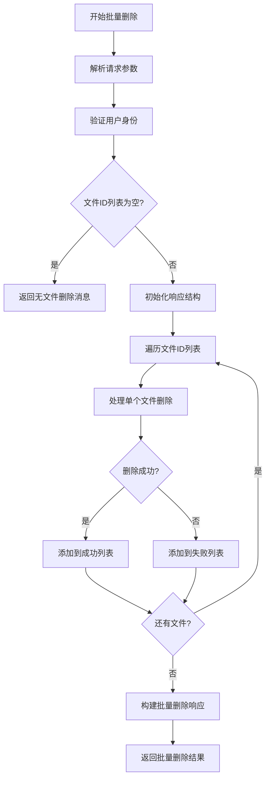
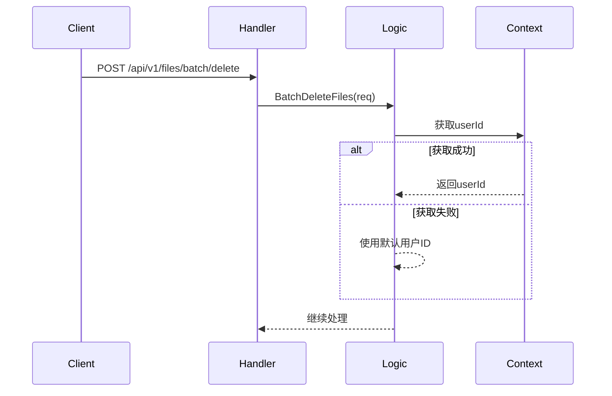
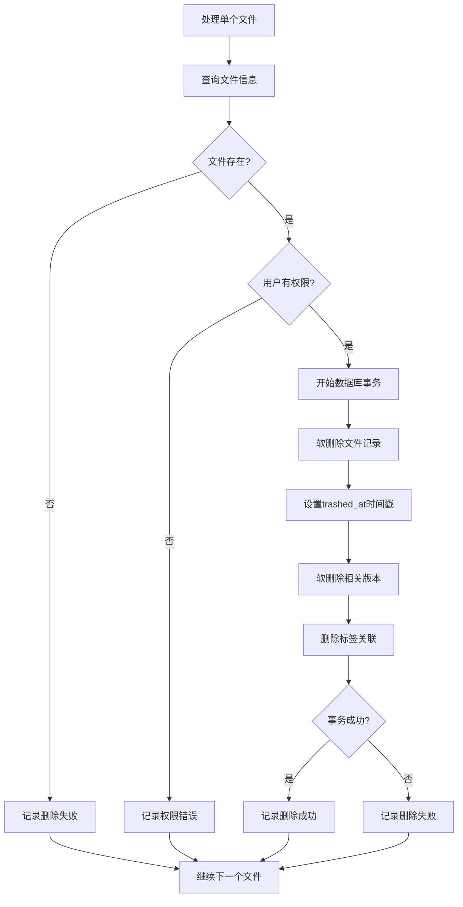
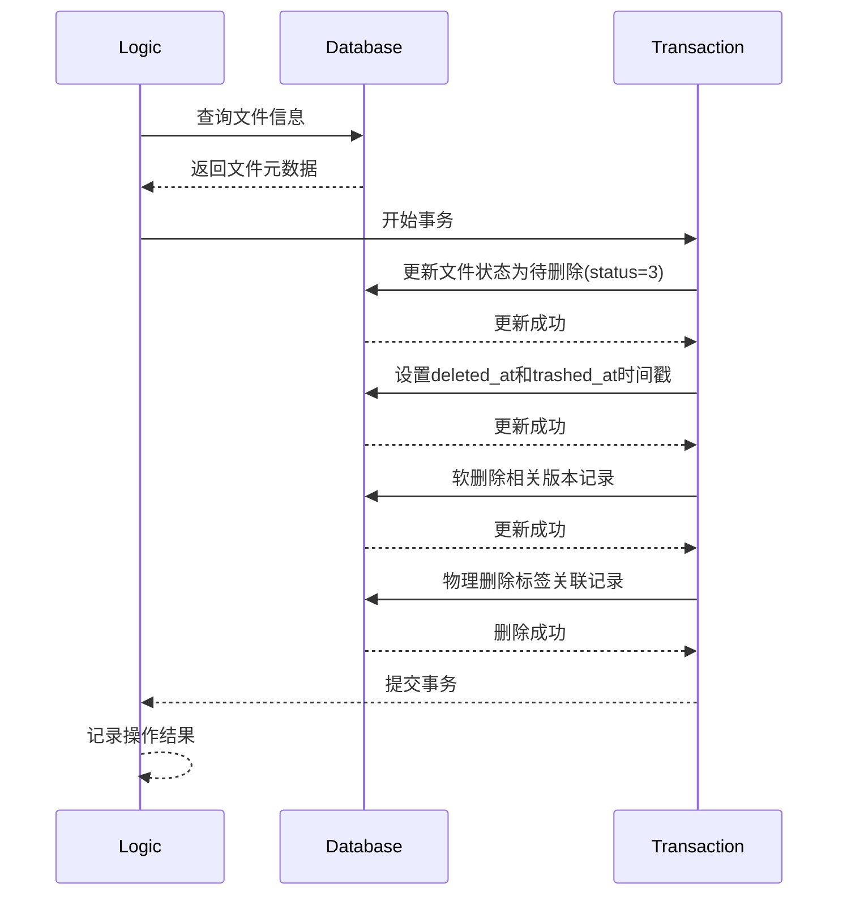
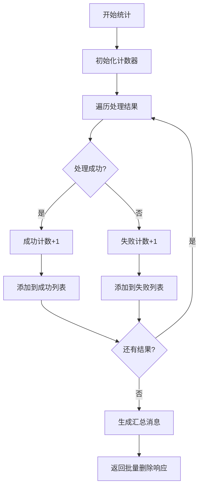
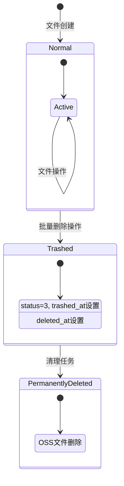
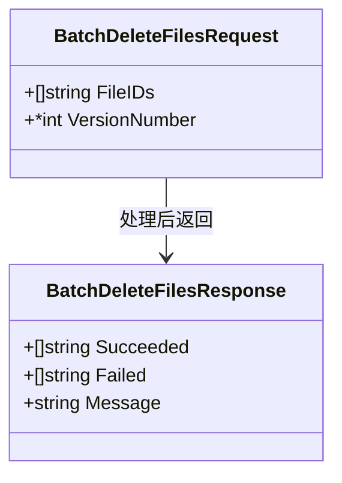

# 批量删除文件处理流程详解

本文档详细介绍批量删除文件的处理流程，并通过多个mermaid图表进行可视化说明。

## 整体流程概览



## 详细步骤分析

### 1. 请求处理与身份验证



### 2. 单个文件删除处理流程



### 3. 数据库操作详细流程



### 4. 错误处理与结果统计



## 数据变更示意图



## 响应结构说明



## 关键特性说明

### 1. 原子性保证
- 每个文件的删除操作使用独立的数据库事务
- 单个文件删除失败不会影响其他文件的处理
- 提供详细的成功/失败文件列表

### 2. 软删除策略
- 文件记录标记为待删除状态(status=3)
- 设置 `deleted_at` 和 `trashed_at` 时间戳
- OSS文件保留，便于后续恢复

### 3. 关联数据处理
- 文件版本记录同步软删除
- 标签关联记录物理删除
- 保持数据一致性

### 4. 错误容错机制
- 单个文件处理失败时记录错误但继续处理
- 版本删除失败不阻断主流程
- 标签关联删除失败仅记录日志

## 使用示例

### 请求示例
```json
{
    "fileIds": [
        "abc123def456",
        "xyz789uvw012",
        "mno345pqr678"
    ]
}
```

### 响应示例
```json
{
    "succeeded": [
        "abc123def456",
        "mno345pqr678"
    ],
    "failed": [
        "xyz789uvw012"
    ],
    "message": "Batch move to trash completed: 2 succeeded, 1 failed"
}
```

## 性能考虑

1. **批量处理效率**：逐个处理文件，避免大事务锁定
2. **数据库连接**：复用查询构建器，减少连接开销
3. **错误隔离**：单个失败不影响整体处理
4. **日志记录**：详细记录操作过程便于问题排查

整个批量删除流程设计注重稳定性和用户体验，确保即使在部分文件处理失败的情况下也能提供有用的反馈信息。
