# 文件删除处理流程详解

本文档详细介绍文件删除的处理流程，并通过多个mermaid图表进行可视化说明。

## 整体流程概览

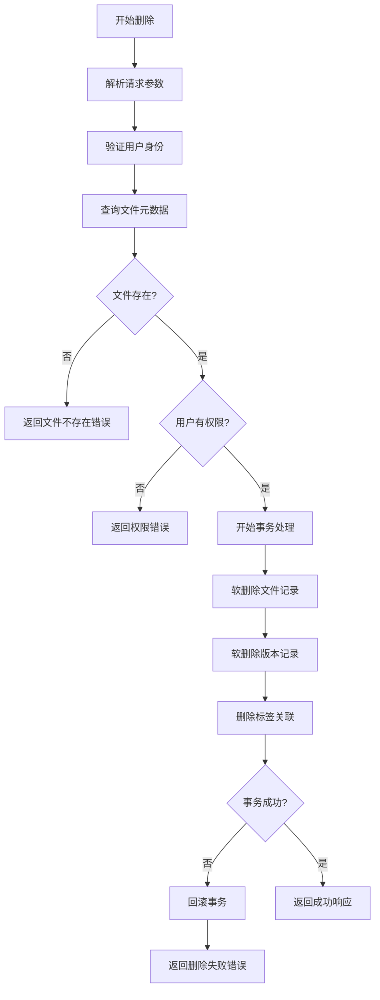

## 详细步骤分析

### 1. 请求处理与身份验证

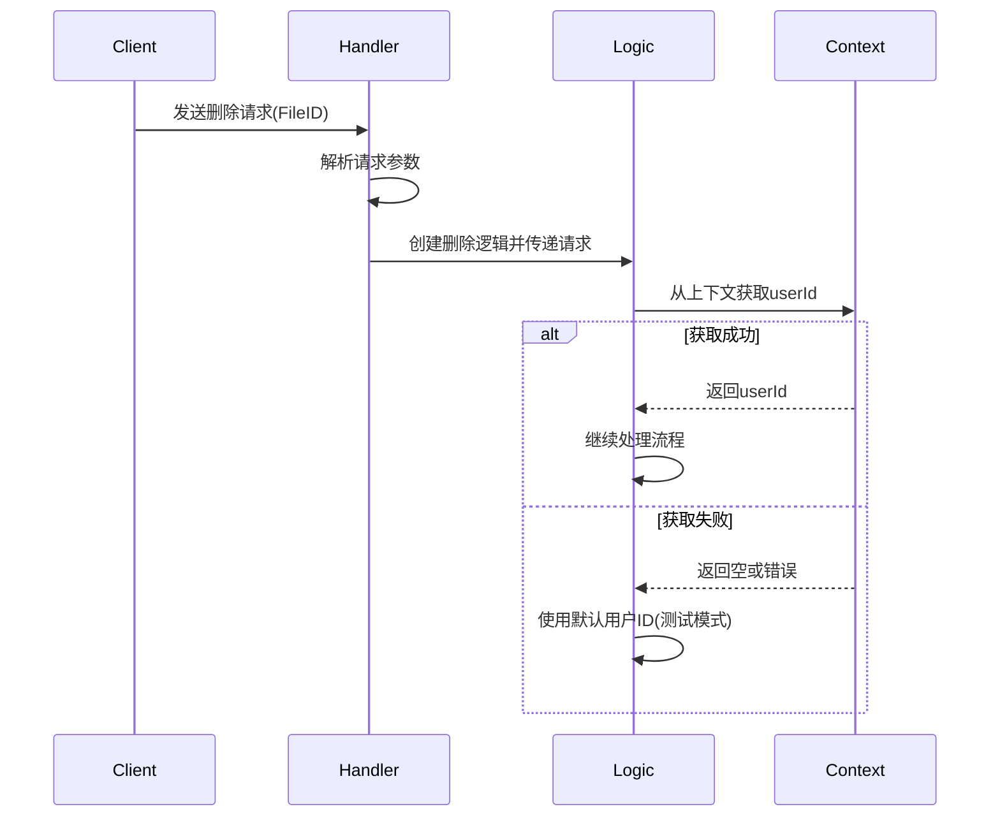

### 2. 文件查询与权限验证

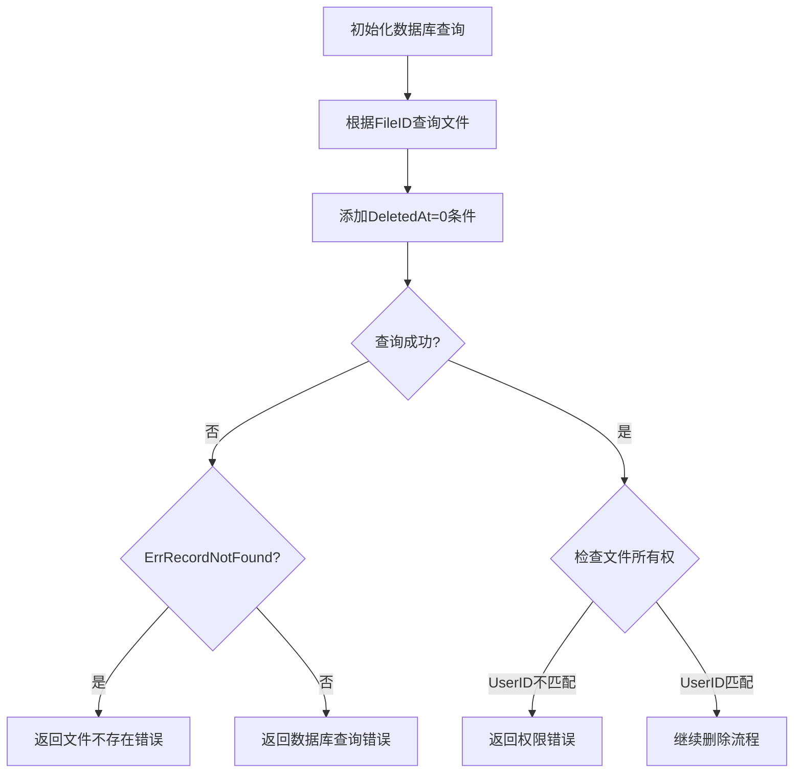

### 3. 事务处理流程

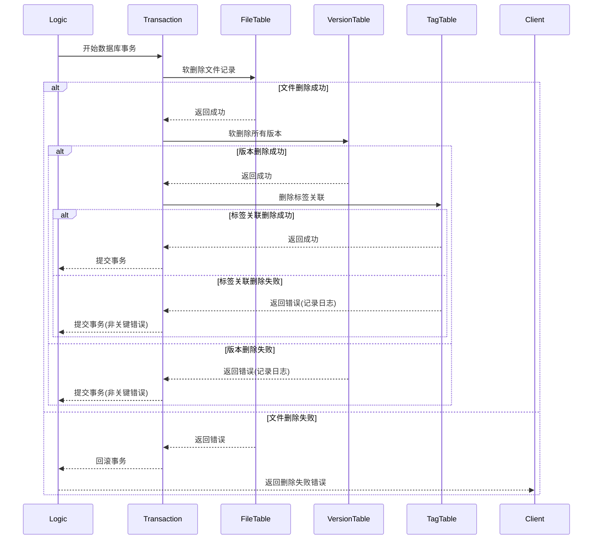

### 4. 软删除机制详解

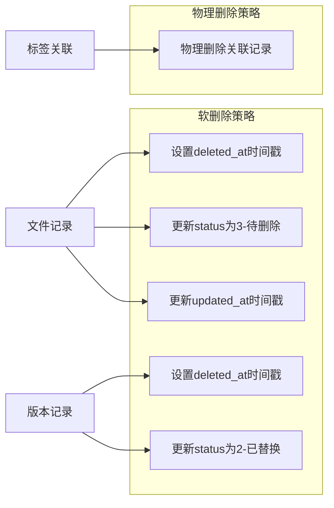

## 数据库操作分析

### 文件状态变更

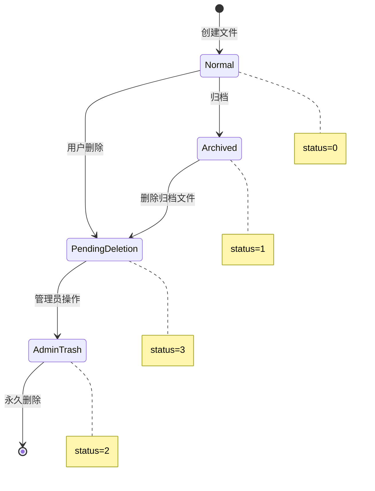

### 版本状态变更

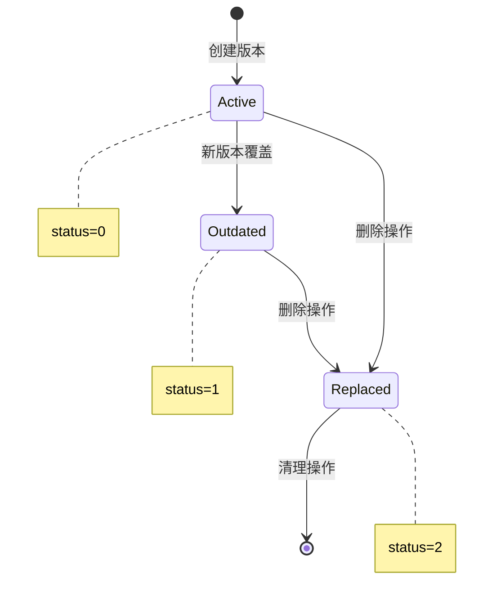

## 数据库模型关系及删除影响

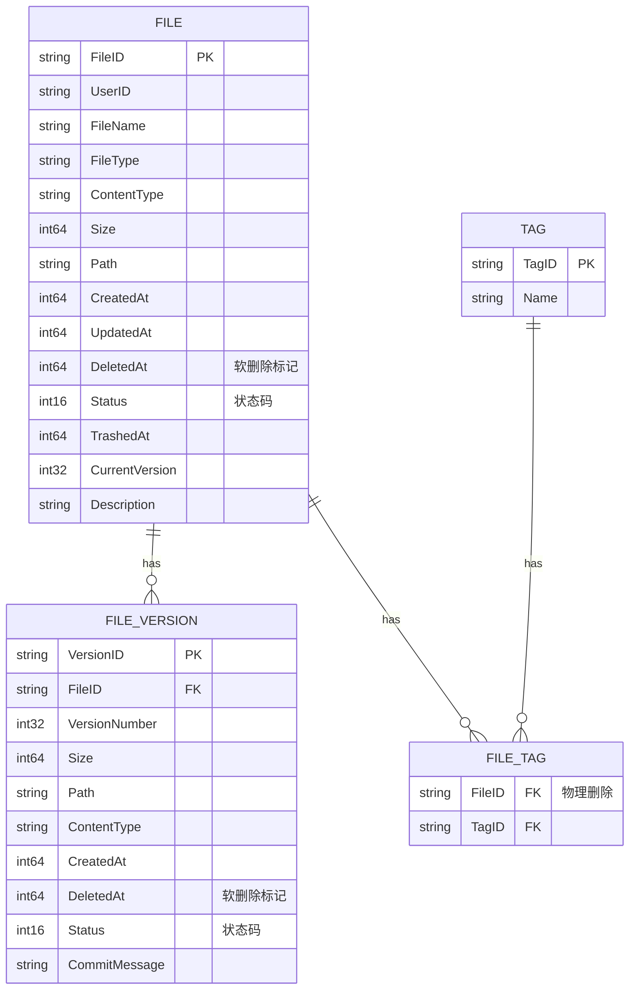

## 错误处理流程

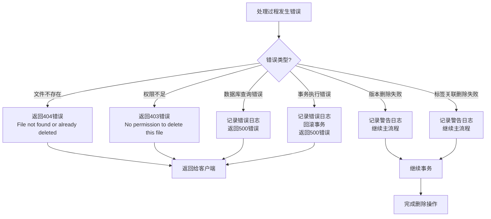

## 安全性考虑

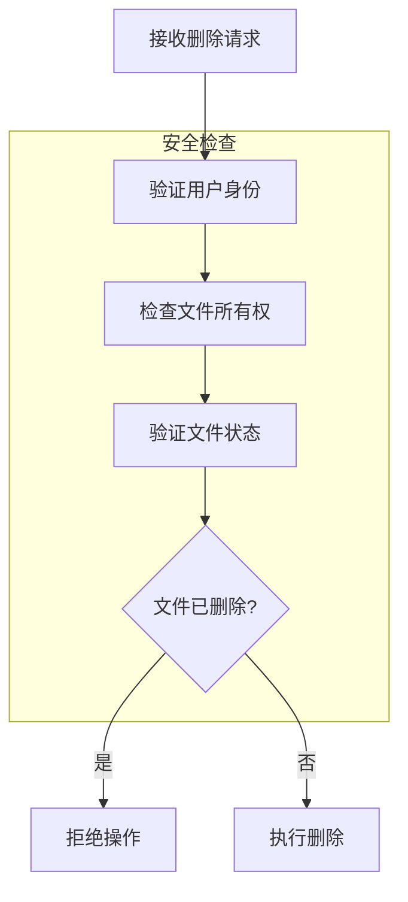

## OSS文件保留策略

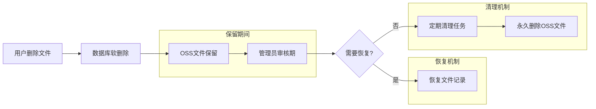

## 成功删除响应流程

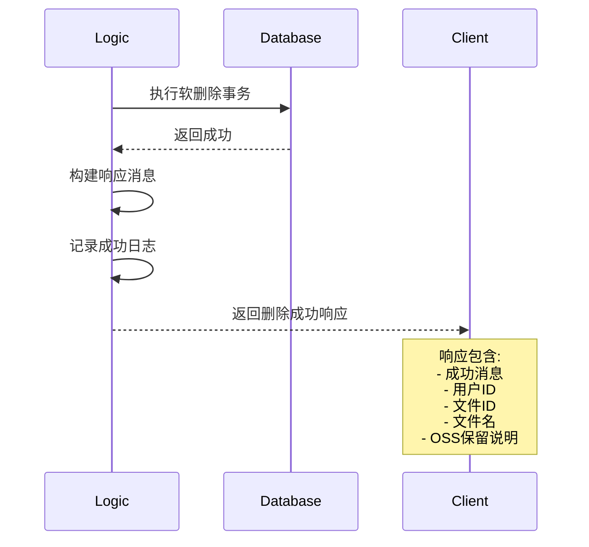

## 日志记录策略

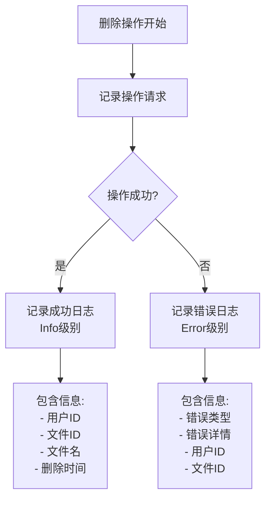

## 关键设计特点

### 1. 软删除机制

- **文件记录**: 设置 `deleted_at` 时间戳，状态更新为3（待删除）
- **版本记录**: 设置 `deleted_at` 时间戳，状态更新为2（已替换）
- **OSS文件**: 保留不删除，便于数据恢复和审计

### 2. 事务一致性

- 使用数据库事务确保所有相关记录的一致性更新
- 核心操作失败时自动回滚
- 非关键操作失败时记录日志但不影响主流程

### 3. 权限控制

- 验证文件所有权，防止越权删除
- 支持软删除状态检查，避免重复删除

### 4. 错误处理

- 详细的错误分类和处理
- 适当的日志记录级别
- 清晰的错误消息返回

### 5. 数据保护

- OSS文件保留策略，支持数据恢复
- 软删除机制，避免意外数据丢失
- 详细的操作日志，支持审计追踪

整个删除流程设计注重数据安全和操作可逆性，通过软删除机制和OSS文件保留，为用户提供数据保护的同时，也为系统管理员提供了灵活的数据管理能力。
