# 获取文件版本差异处理流程详解

本文档详细介绍获取文件版本差异的处理流程，并通过多个 mermaid 图表进行可视化说明。

## 整体流程概览

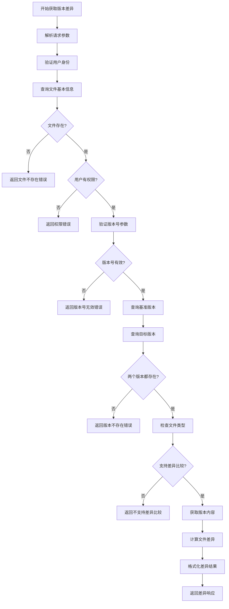

## 详细步骤分析

### 1. 请求处理与验证

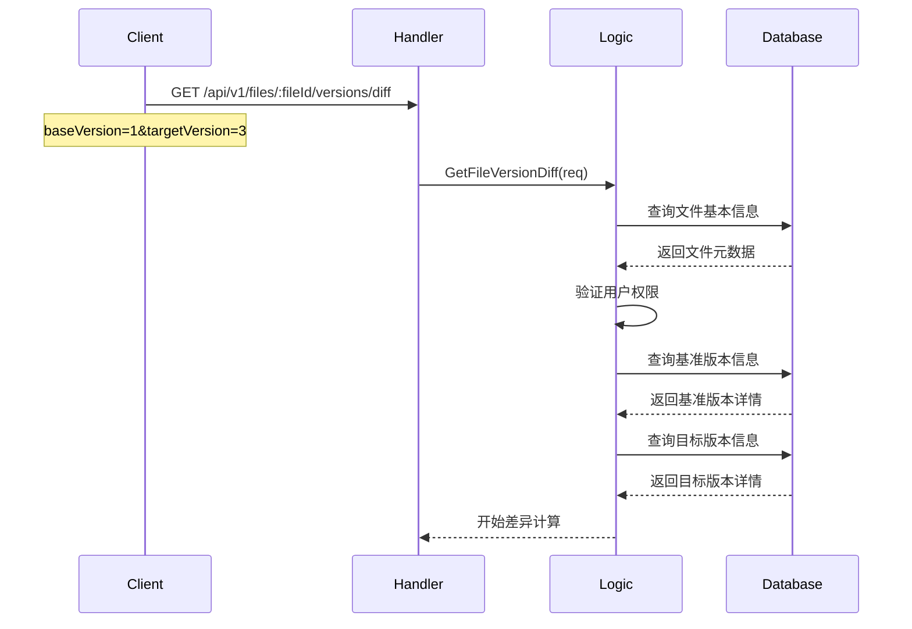

### 2. 版本内容获取流程

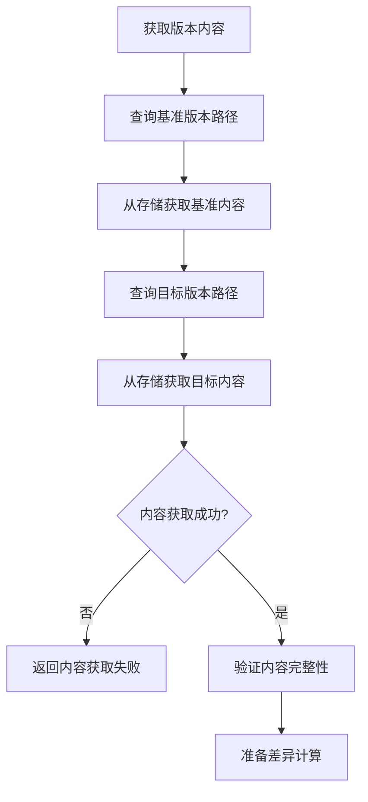

### 3. 文件类型处理

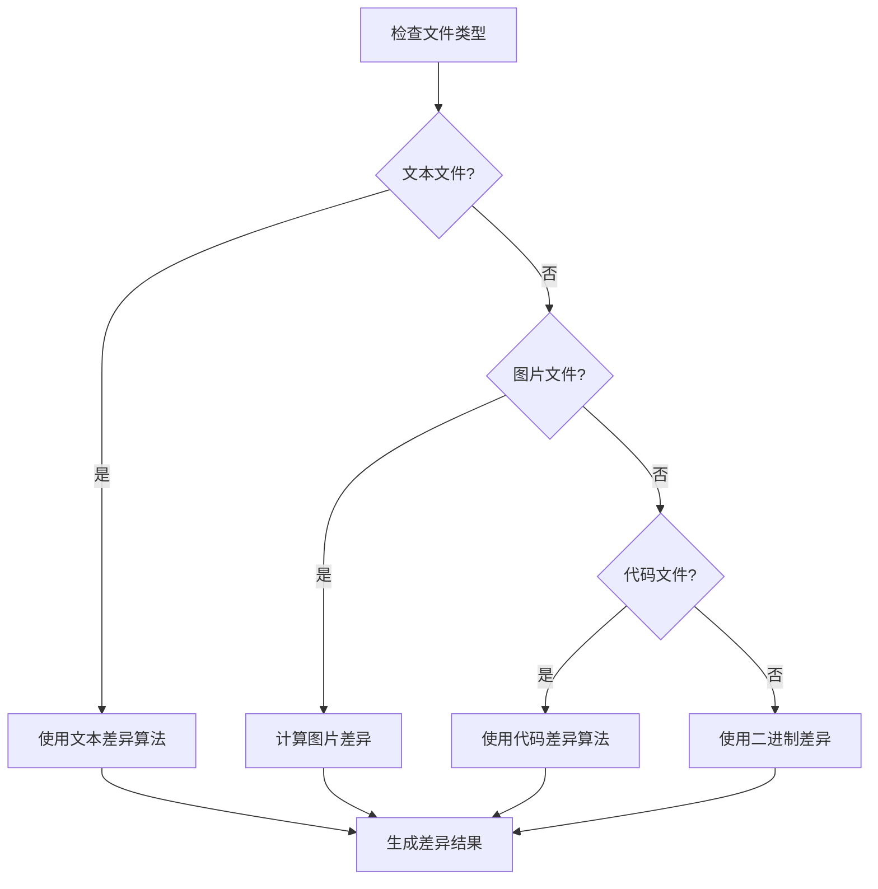

### 4. 差异计算算法

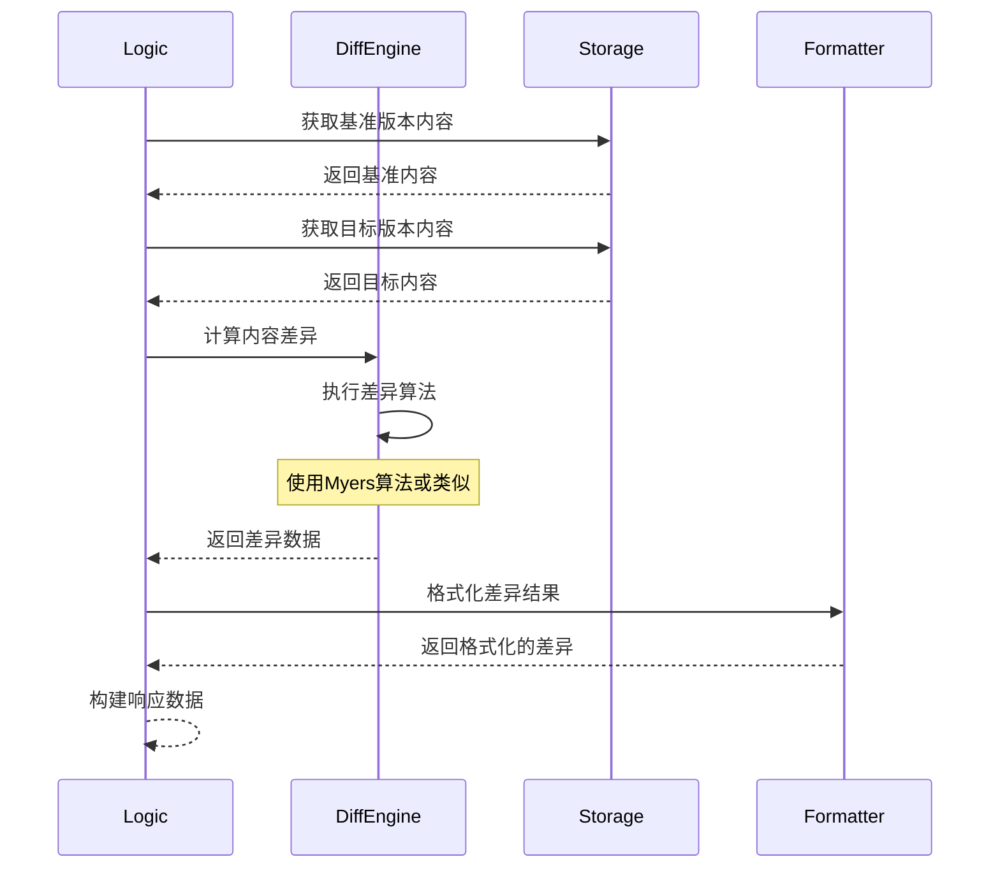

## 差异算法选择

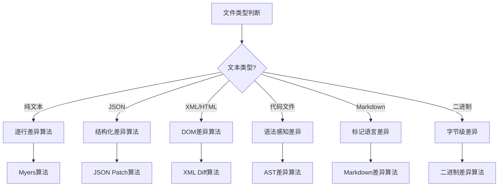

## 差异结果格式

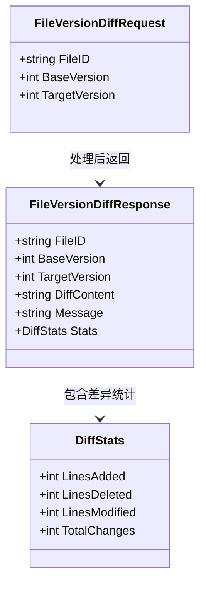

## 差异输出格式示例

### 1. 统一差异格式 (Unified Diff)

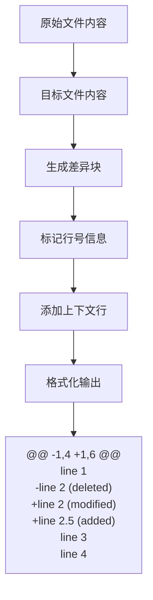

### 2. 结构化差异格式

```json
{
  "changes": [
    {
      "type": "delete",
      "lineNumber": 2,
      "content": "old content"
    },
    {
      "type": "add",
      "lineNumber": 2,
      "content": "new content"
    }
  ]
}
```

## 使用示例

### 请求示例

```http
GET /api/v1/files/abc123def456/versions/diff?baseVersion=1&targetVersion=3 HTTP/1.1
Host: localhost:8080
Authorization: Bearer <jwt-token>
```

### 响应示例

```json
{
  "fileId": "abc123def456",
  "baseVersion": 1,
  "targetVersion": 3,
  "diffContent": "@@ -1,10 +1,12 @@\n # 项目文档\n \n-## 旧的章节标题\n+## 新的章节标题\n \n 这是一些内容...\n \n+## 新增的章节\n+这是新增的内容。\n+\n ## 结论\n 项目总结内容。",
  "stats": {
    "linesAdded": 3,
    "linesDeleted": 1,
    "linesModified": 1,
    "totalChanges": 5
  },
  "message": "Successfully generated diff between version 1 and version 3"
}
```

## 关键特性说明

### 1. 多格式支持

- 支持多种文件类型的差异比较
- 智能选择最适合的差异算法
- 可扩展的差异处理器架构

### 2. 性能优化

- 大文件分块处理
- 缓存常用版本内容
- 异步处理复杂差异计算

### 3. 用户友好

- 清晰的差异可视化
- 详细的统计信息
- 支持多种输出格式

### 4. 安全性

- 严格的权限验证
- 内容访问控制
- 操作日志记录

## 错误处理场景

### 1. 版本不存在

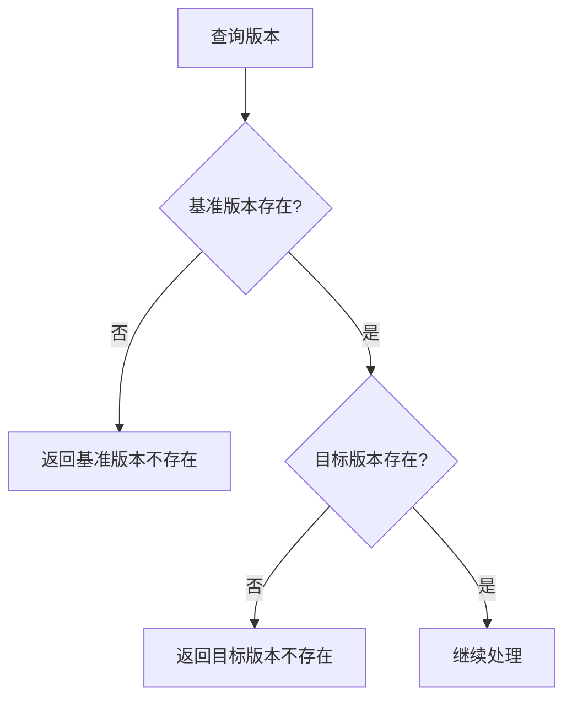

### 2. 文件类型不支持

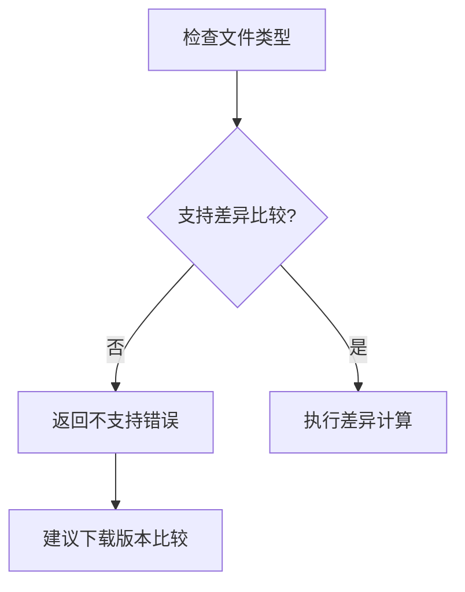

### 3. 内容获取失败

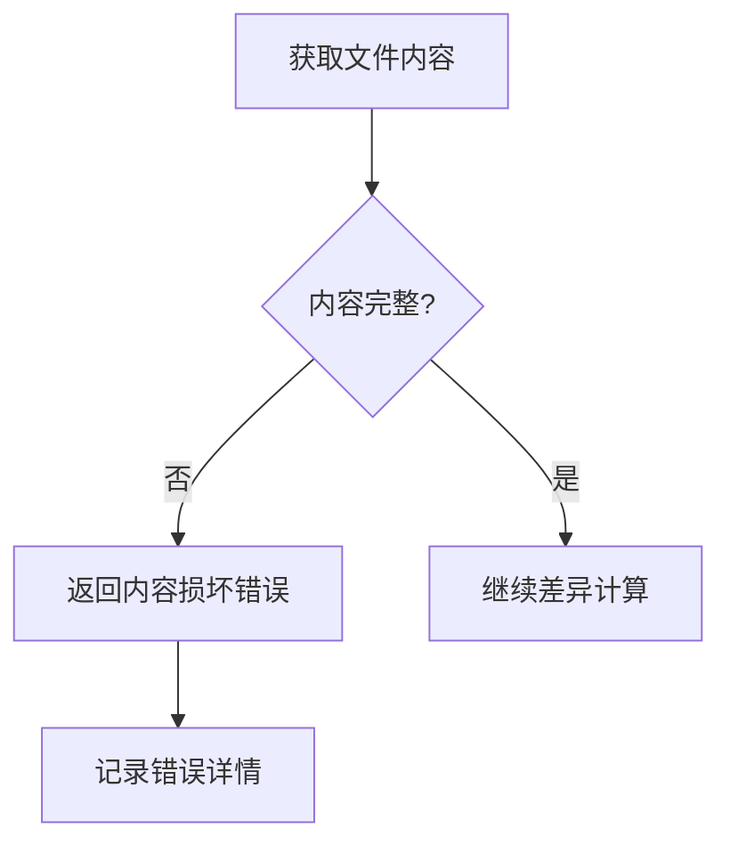

## 性能考虑

### 1. 缓存策略

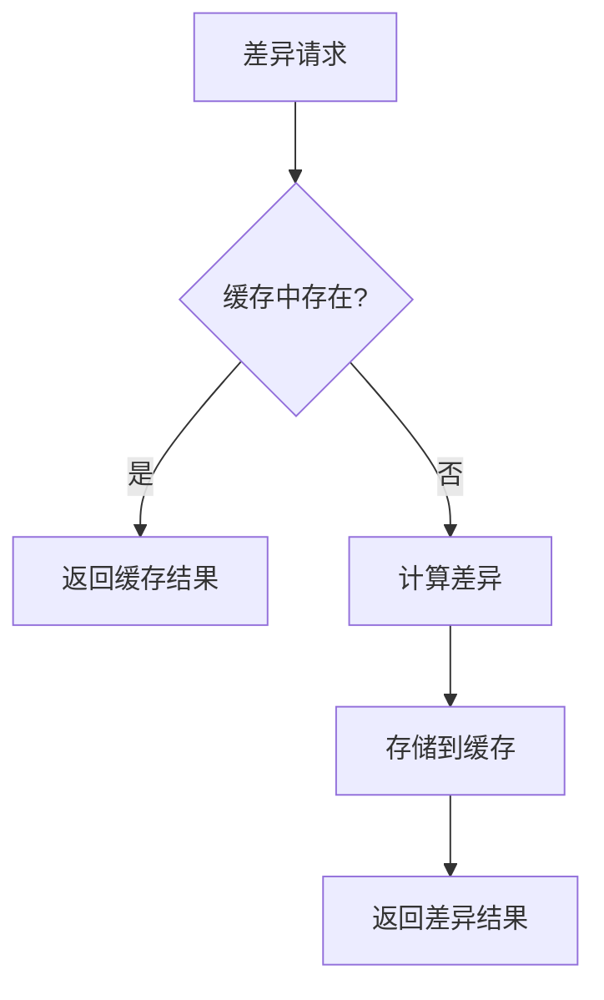

### 2. 大文件处理

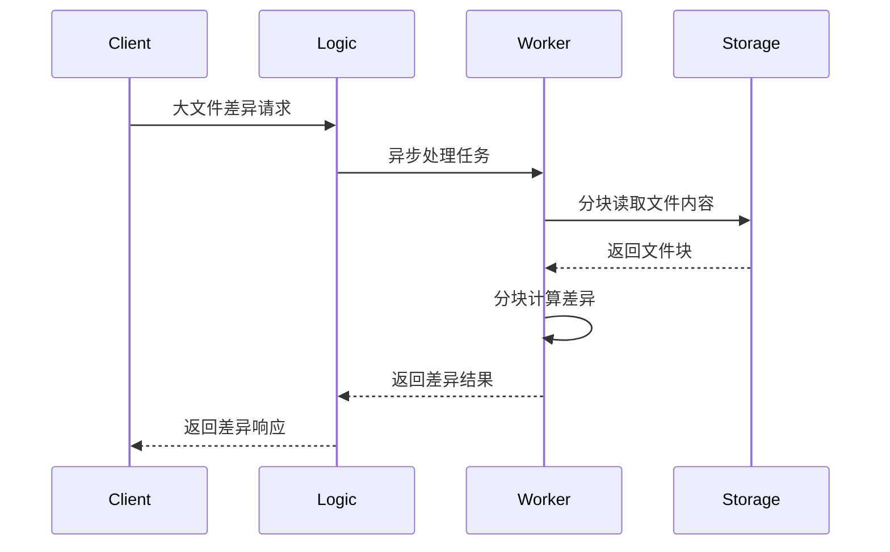
