# 获取文件版本历史处理流程详解

本文档详细介绍获取文件版本历史的处理流程，并通过多个mermaid图表进行可视化说明。

## 整体流程概览

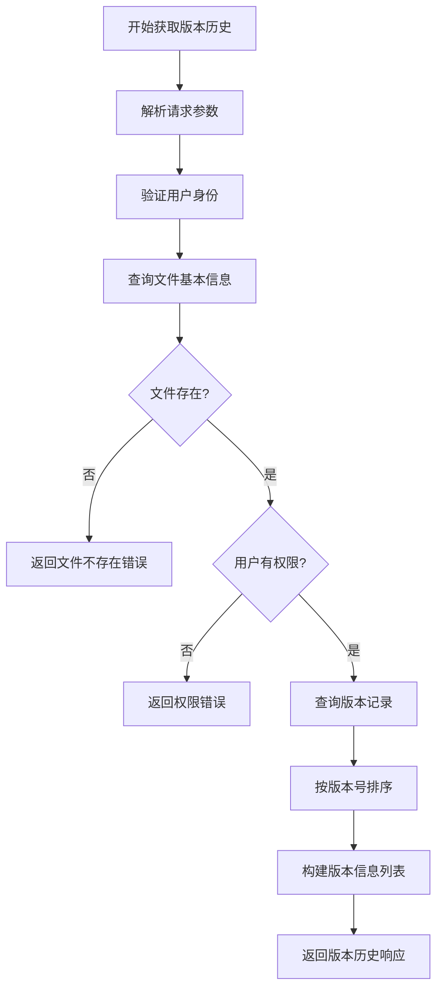

## 详细步骤分析

### 1. 请求处理与验证

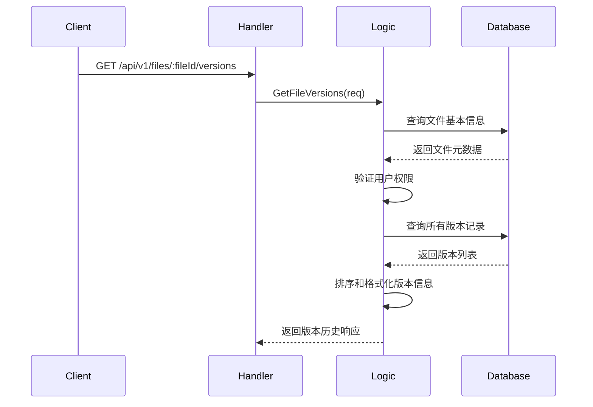

### 2. 版本查询处理

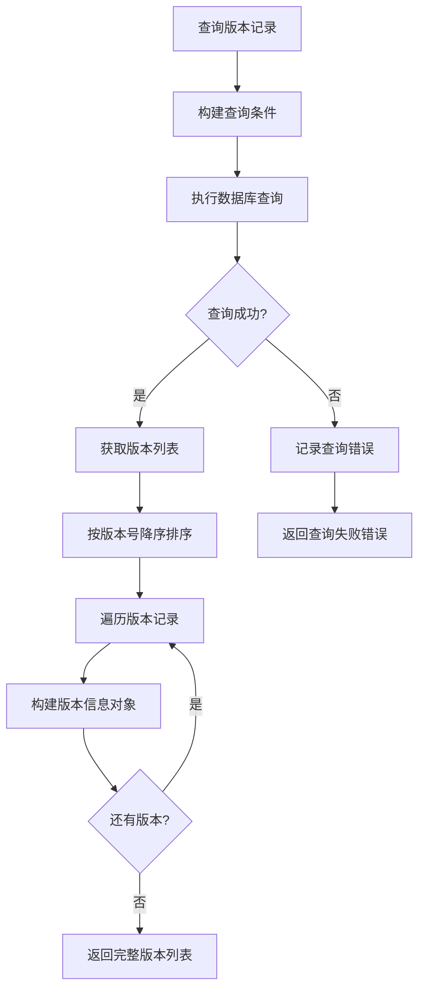

### 3. 版本信息构建流程

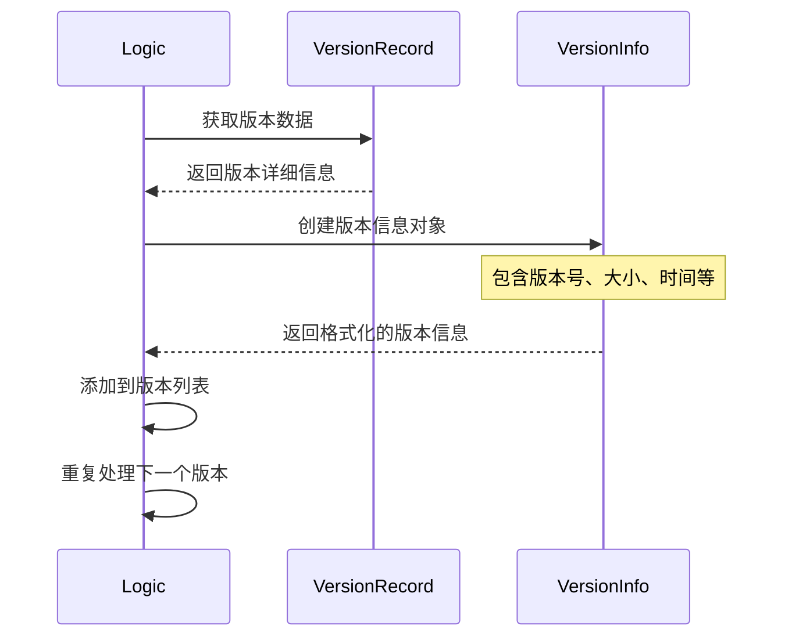

## 数据查询示意图

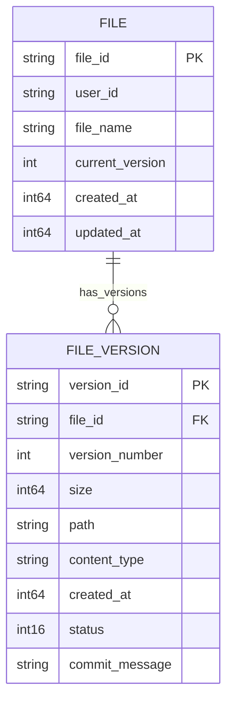

## 版本状态管理

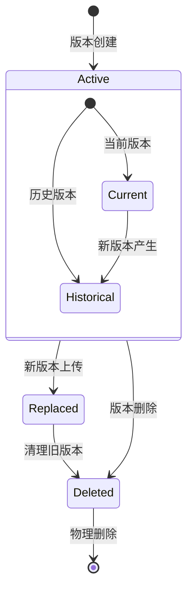

## 响应结构说明

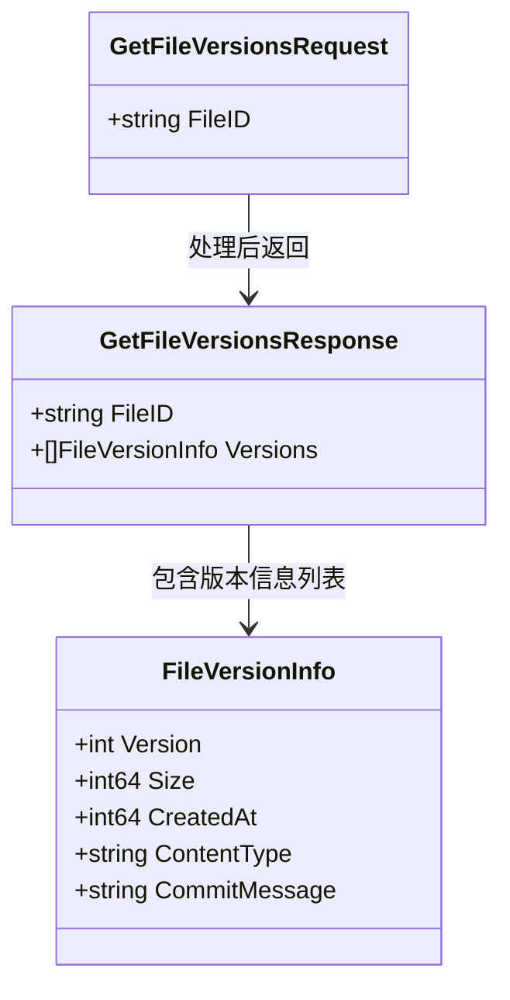

## 版本排序逻辑

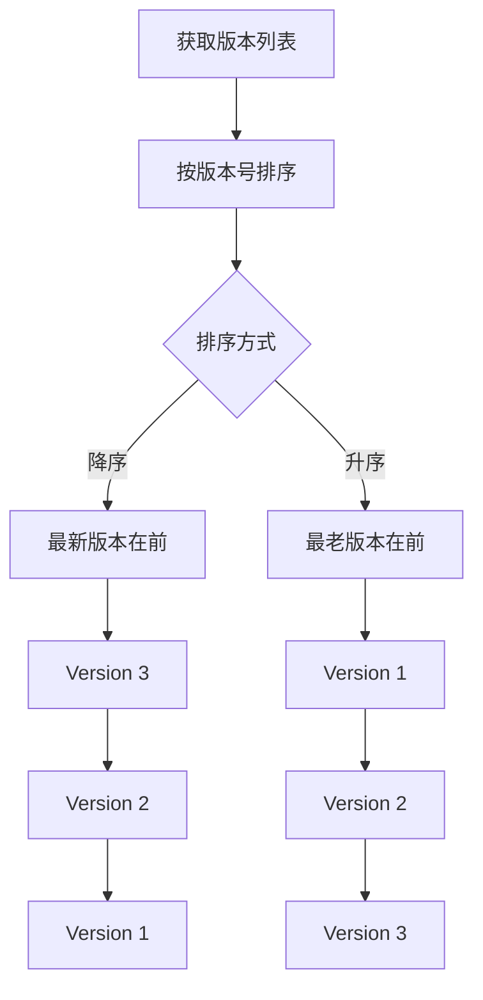

## 使用示例

### 请求示例

```http
GET /api/v1/files/abc123def456/versions HTTP/1.1
Host: localhost:8080
Authorization: Bearer <jwt-token>
```

### 响应示例

```json
{
    "fileId": "abc123def456",
    "versions": [
        {
            "version": 3,
            "size": 2048576,
            "createdAt": 1634567890,
            "contentType": "application/pdf",
            "commitMessage": "更新文件元数据"
        },
        {
            "version": 2,
            "size": 2045678,
            "createdAt": 1634567800,
            "contentType": "application/pdf", 
            "commitMessage": "修复文档内容错误"
        },
        {
            "version": 1,
            "size": 2041234,
            "createdAt": 1634567700,
            "contentType": "application/pdf",
            "commitMessage": "初始版本上传"
        }
    ]
}
```

## 关键特性说明

### 1. 权限控制

- 只有文件所有者可以查看版本历史
- 支持基于JWT的身份验证
- 详细的权限检查日志

### 2. 数据完整性

- 查询时过滤已删除的版本
- 确保版本号的连续性
- 维护版本创建时间顺序

### 3. 性能优化

- 使用数据库索引加速查询
- 按需加载版本信息
- 合理的查询字段选择

### 4. 错误处理

- 文件不存在时的友好提示
- 权限不足时的明确错误信息
- 数据库查询失败的错误记录

## 版本信息字段说明

| 字段名        | 类型   | 说明                       |
| ------------- | ------ | -------------------------- |
| version       | int    | 版本号，从1开始递增        |
| size          | int64  | 该版本文件的大小（字节）   |
| createdAt     | int64  | 版本创建时间（Unix时间戳） |
| contentType   | string | 文件的MIME类型             |
| commitMessage | string | 版本提交信息（可选）       |

## 扩展功能

### 1. 版本过滤

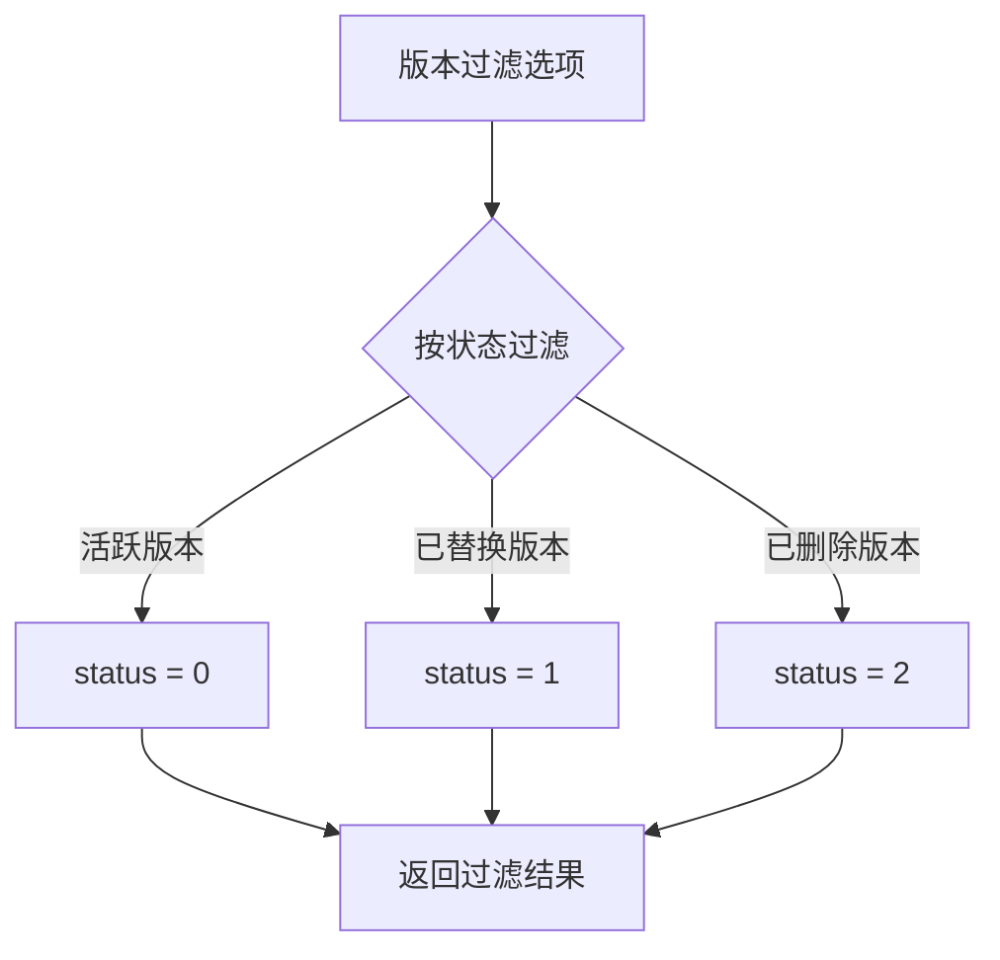

### 2. 分页支持

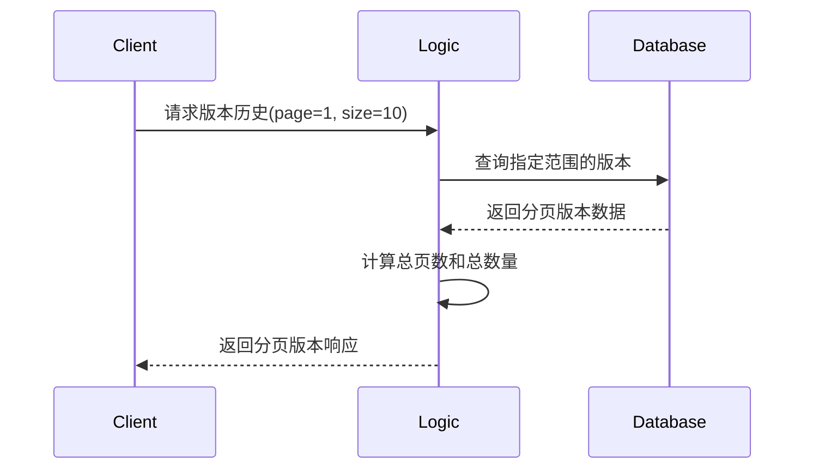

### 3. 版本差异预览

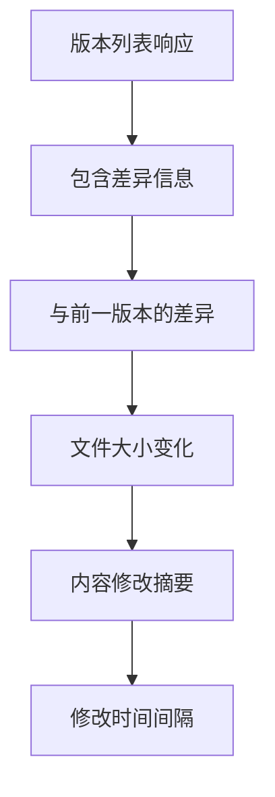

## 性能考虑

1. **索引优化**：在 `file_id` 和 `version_number` 上建立复合索引
2. **查询限制**：合理限制返回的版本数量
3. **缓存策略**：对热点文件的版本信息进行缓存
4. **异步加载**：大文件的版本历史可以异步加载详细信息

## 监控指标

- 版本历史查询频率
- 平均版本数量统计
- 查询响应时间
- 错误率统计

整个版本历史查询流程设计简洁高效，为用户提供了清晰的文件演进历史，有助于文件管理和版本控制。
