# 恢复文件版本处理流程详解

本文档详细介绍恢复文件版本的处理流程，并通过多个mermaid图表进行可视化说明。

## 整体流程概览

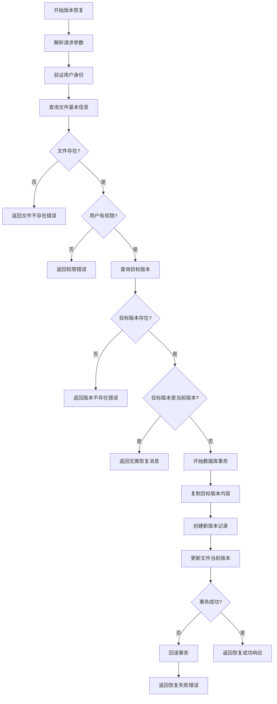

## 详细步骤分析

### 1. 请求处理与验证

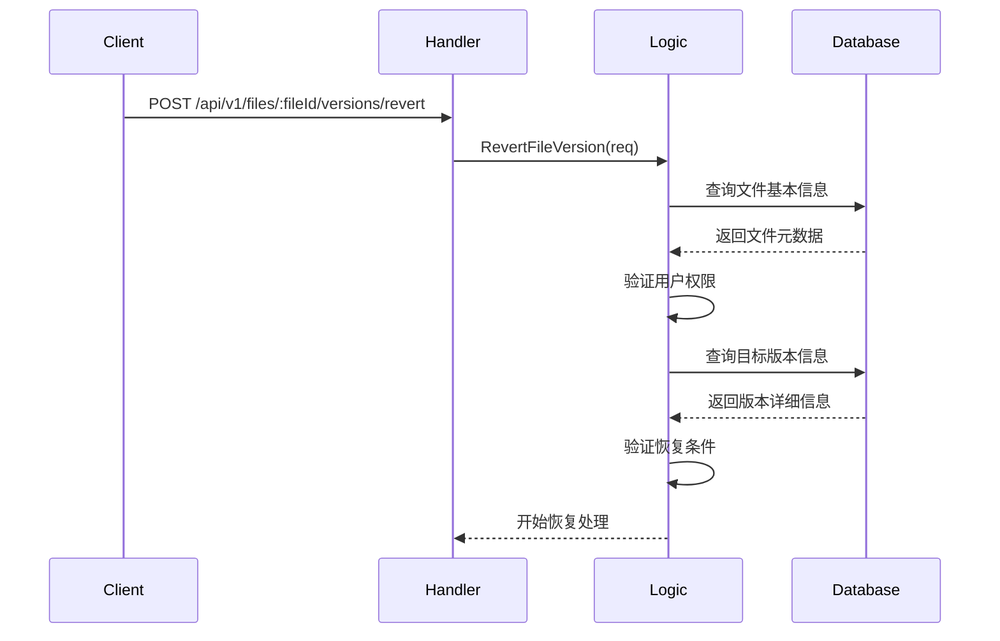

### 2. 版本恢复处理流程

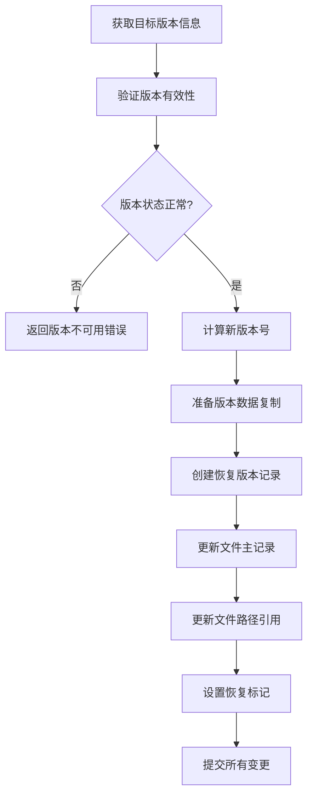

### 3. 数据库事务处理

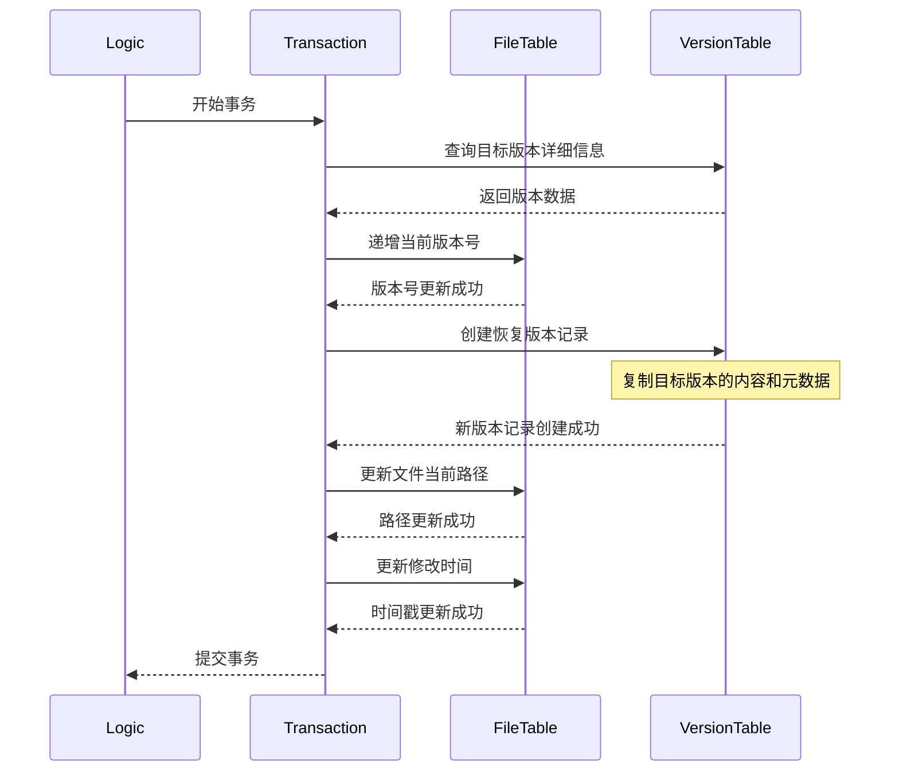

## 版本恢复逻辑示意图

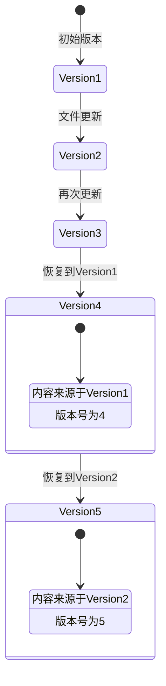

## 数据复制流程

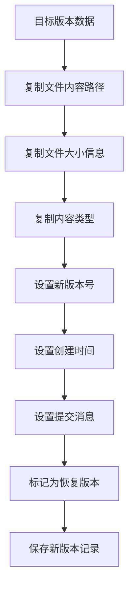

## 响应结构说明

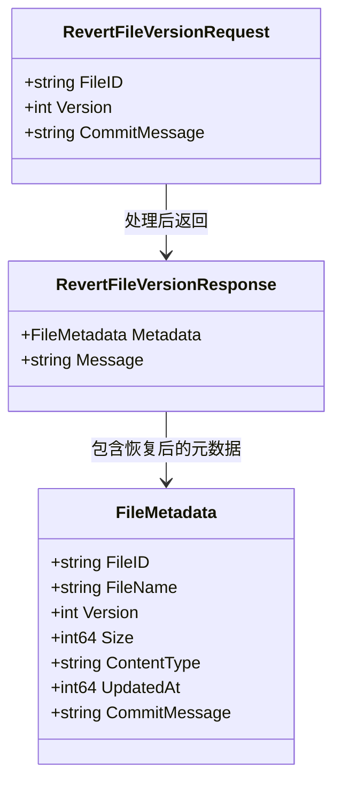

## 版本历史变化

```mermaid
gantt
    title 文件版本时间线
    dateFormat X
    axisFormat %s
    
    section 版本历史
    Version 1 (原始)    :done, v1, 0, 1
    Version 2 (更新)    :done, v2, 1, 2
    Version 3 (修改)    :done, v3, 2, 3
    Version 4 (恢复到V1) :active, v4, 3, 4
    
    section 当前状态
    当前版本 V4        :crit, current, 3, 4
```

## 使用示例

### 请求示例

```json
{
    "version": 2,
    "commitMessage": "恢复到修复bug前的版本"
}
```

### 响应示例

```json
{
    "metadata": {
        "fileId": "abc123def456",
        "userId": "user123",
        "fileName": "重要文档.pdf",
        "fileType": "document",
        "contentType": "application/pdf",
        "size": 2045678,
        "version": 5,
        "updatedAt": 1634567890,
        "commitMessage": "恢复到修复bug前的版本"
    },
    "message": "File successfully reverted to version 2. New version: 5"
}
```

## 关键特性说明

### 1. 版本完整性

- 保留所有历史版本记录
- 恢复操作不会删除任何现有版本
- 创建新版本来表示恢复状态

### 2. 数据一致性

- 使用数据库事务确保原子性
- 失败时自动回滚所有变更
- 维护版本号的连续性

### 3. 智能恢复

- 检测目标版本是否为当前版本
- 验证目标版本的可用性
- 支持自定义恢复说明

### 4. 审计跟踪

- 记录恢复操作的详细信息
- 保留操作时间和用户信息
- 支持恢复历史查询

## 错误处理场景

### 1. 目标版本不存在

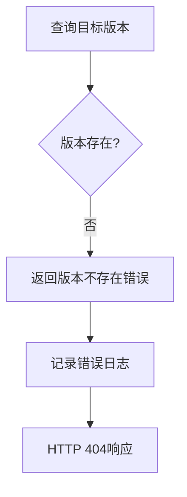

### 2. 版本状态异常

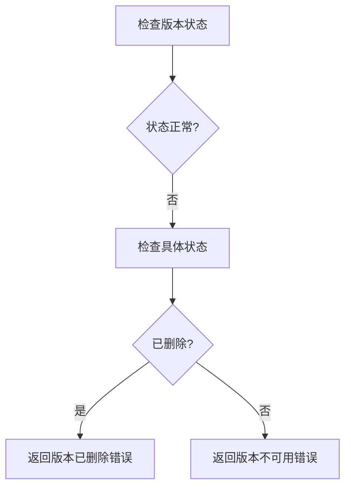

### 3. 权限验证失败

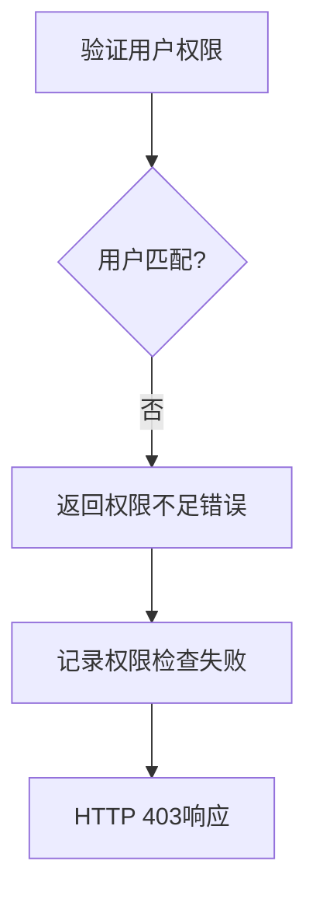

## 性能优化

### 1. 查询优化

- 使用复合索引加速版本查询
- 预加载必要的版本信息
- 避免不必要的数据传输

### 2. 事务优化

- 最小化事务持有时间
- 合理设置事务隔离级别
- 及时释放数据库连接

### 3. 缓存策略

- 缓存热点文件的版本信息
- 使用版本号作为缓存键
- 恢复后更新相关缓存

## 扩展功能

### 1. 批量恢复

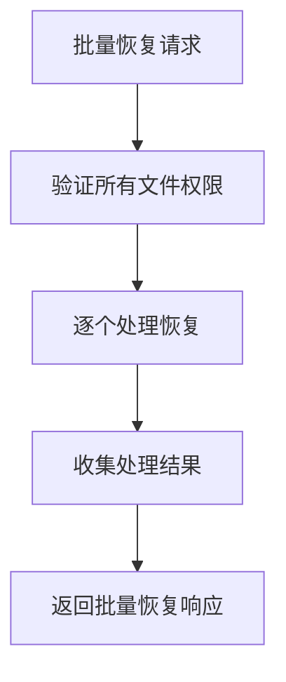

### 2. 恢复预览

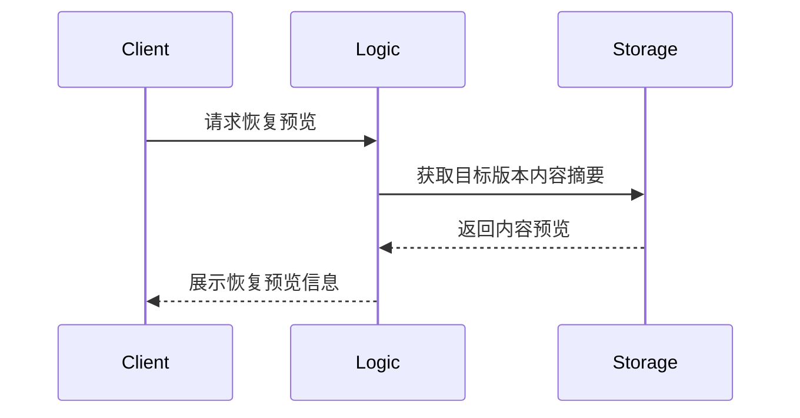

### 3. 恢复确认

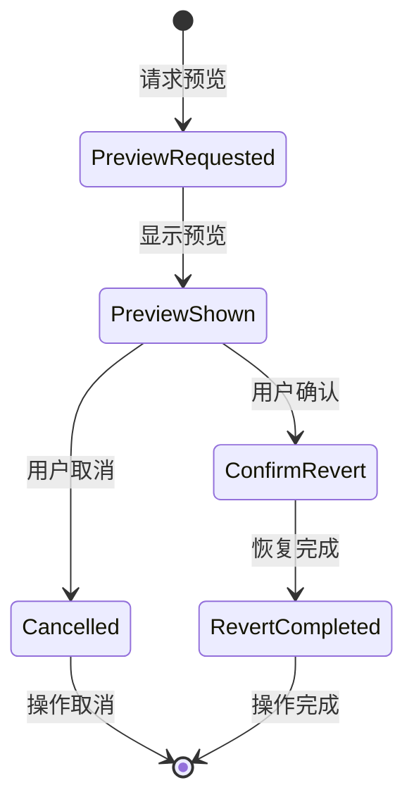

## 监控指标

- 版本恢复操作频率
- 恢复操作成功率
- 平均恢复处理时间
- 最常恢复的版本分析

## 安全考虑

1. **权限控制**：严格验证用户对文件的操作权限
2. **版本验证**：确保恢复的版本数据完整性
3. **操作审计**：记录所有恢复操作的详细日志
4. **并发控制**：防止同时进行的版本操作冲突

整个版本恢复流程设计确保了数据的安全性和一致性，为用户提供了可靠的版本回退功能。
