# 更新文件元数据处理流程详解

本文档详细介绍更新文件元数据的处理流程，并通过多个mermaid图表进行可视化说明。

## 整体流程概览

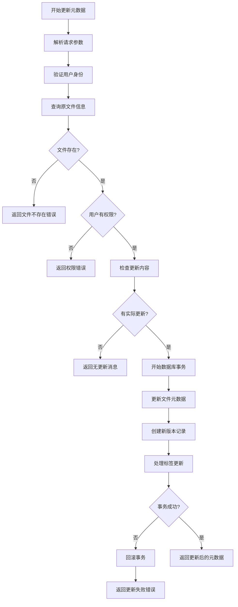

## 详细步骤分析

### 1. 请求处理与验证

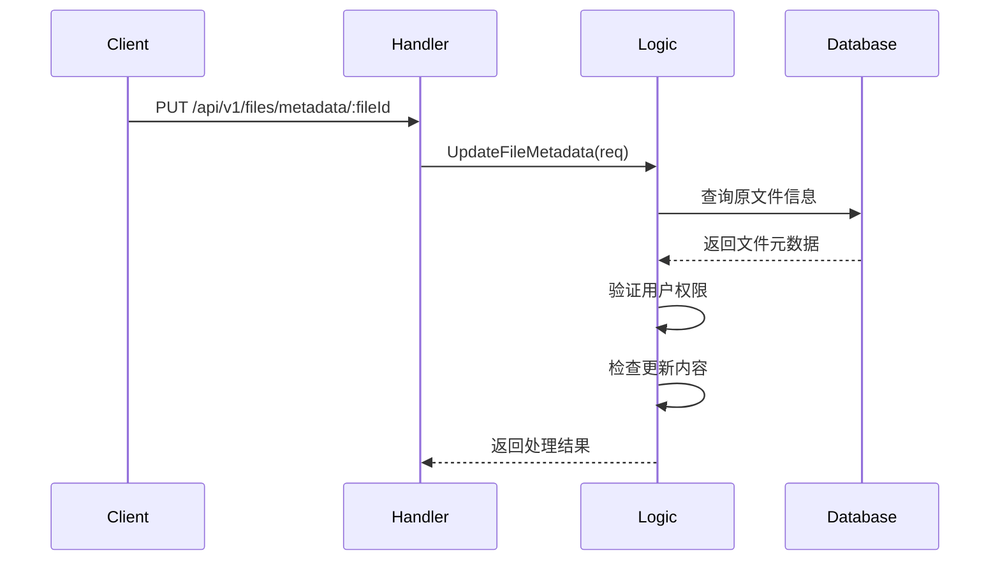

### 2. 元数据更新处理

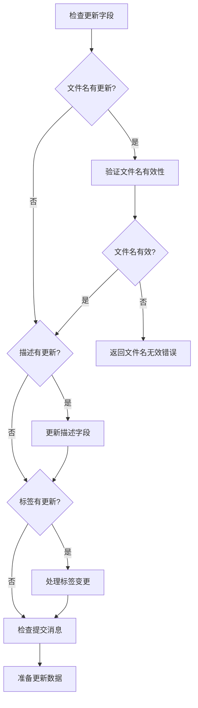

### 3. 版本管理流程

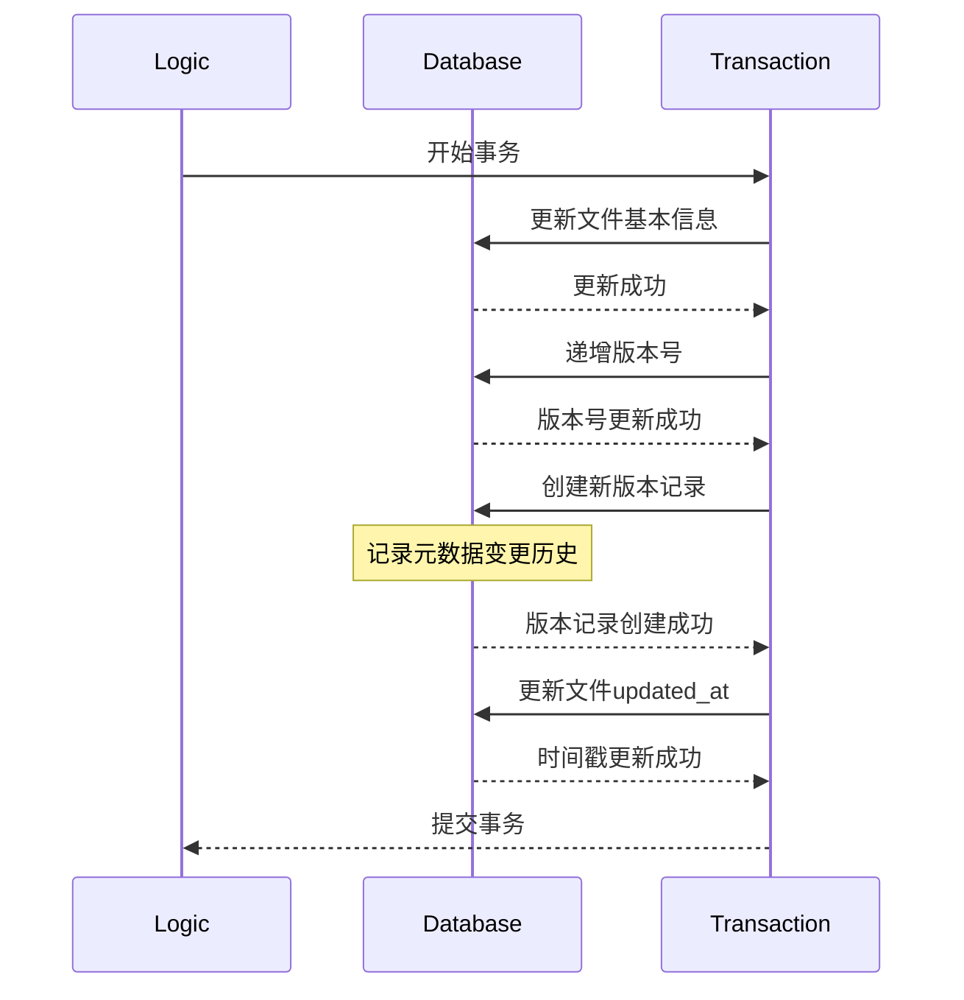

### 4. 标签管理详细流程

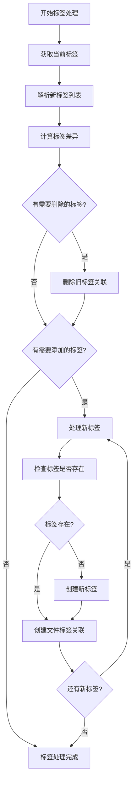

## 数据库变更示意图

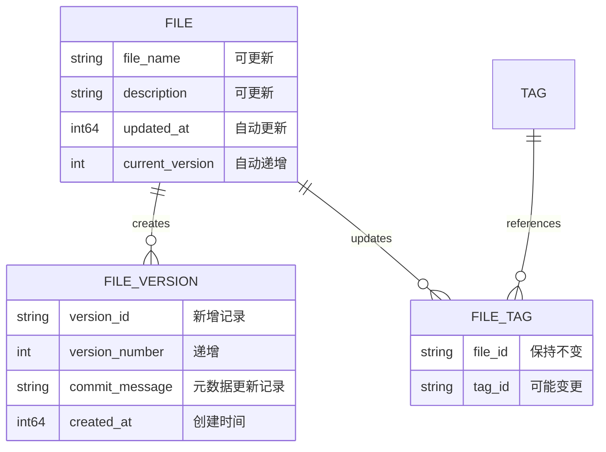

## 版本历史记录

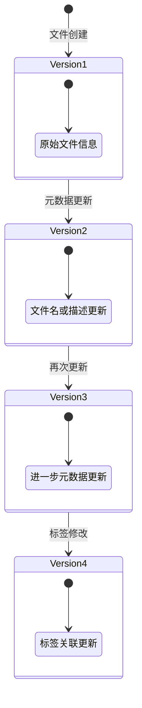

## 响应结构说明

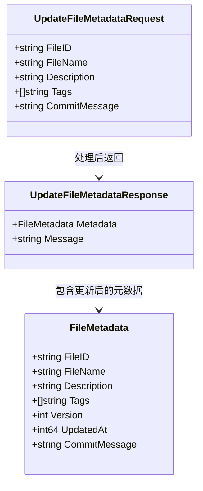

## 关键特性说明

### 1. 版本控制
- 每次元数据更新都会创建新版本记录
- 版本号自动递增
- 保留完整的变更历史

### 2. 标签管理
- 支持标签的增加、删除和修改
- 自动创建不存在的标签
- 清理不再使用的标签关联

### 3. 原子性操作
- 所有更新操作在单个事务中完成
- 失败时自动回滚所有变更
- 确保数据一致性

### 4. 智能更新检测
- 只有实际发生变化的字段才会更新
- 避免不必要的版本创建
- 优化数据库性能

## 使用示例

### 请求示例

```json
{
    "fileName": "新的文件名.pdf",
    "description": "更新后的文件描述",
    "tags": ["重要", "工作", "2024"],
    "commitMessage": "更新文件名和描述，添加新标签"
}
```

### 响应示例

```json
{
    "metadata": {
        "fileId": "abc123def456",
        "userId": "user123",
        "fileName": "新的文件名.pdf",
        "description": "更新后的文件描述",
        "tags": ["重要", "工作", "2024"],
        "version": 3,
        "updatedAt": 1634567890,
        "commitMessage": "更新文件名和描述，添加新标签"
    },
    "message": "File metadata updated successfully to version 3"
}
```

## 错误处理场景

### 1. 文件不存在

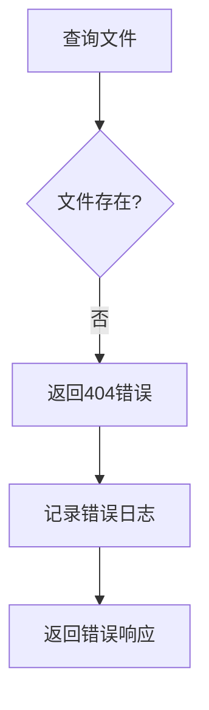

### 2. 权限不足

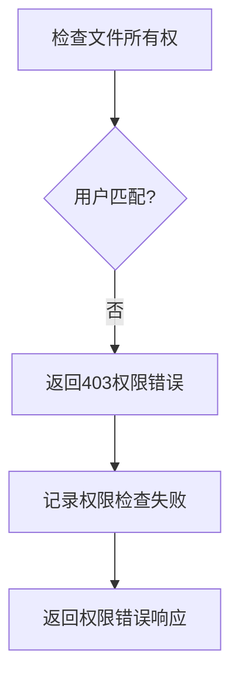

### 3. 数据库事务失败

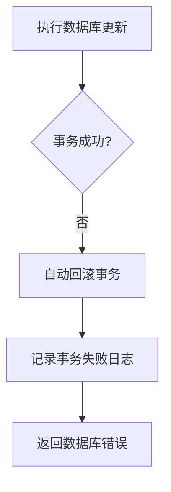

## 性能优化考虑

1. **差异检测**：只更新实际变化的字段
2. **批量标签处理**：一次性处理所有标签变更
3. **索引优化**：在文件ID和更新时间上建立索引
4. **事务粒度**：使用最小必要的事务范围

## 扩展功能

### 1. 元数据验证
- 文件名长度和字符限制
- 描述内容长度限制
- 标签数量和格式验证

### 2. 变更通知
- 可集成消息队列通知其他服务
- 支持webhook回调
- 审计日志记录

### 3. 批量更新
- 未来可扩展支持批量元数据更新
- 异步处理大量文件
- 进度跟踪和状态报告

整个元数据更新流程设计确保了数据的完整性和一致性，同时提供了灵活的版本管理和标签系统。
